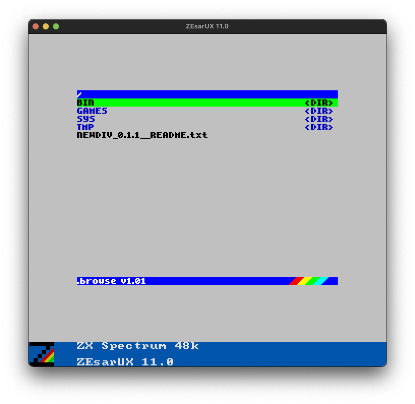
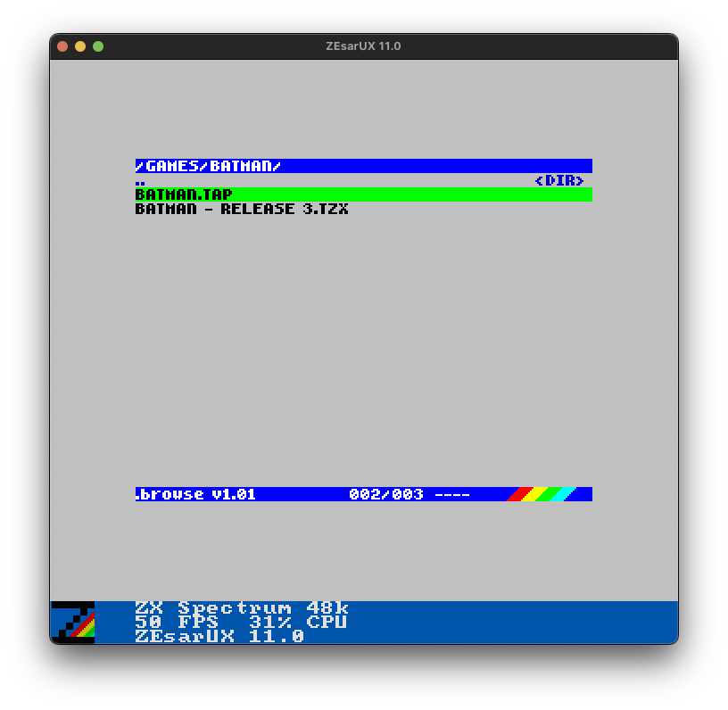
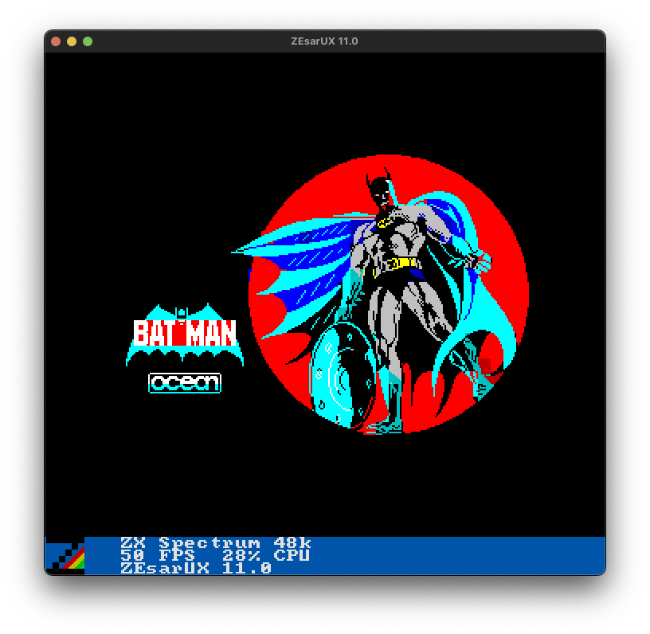
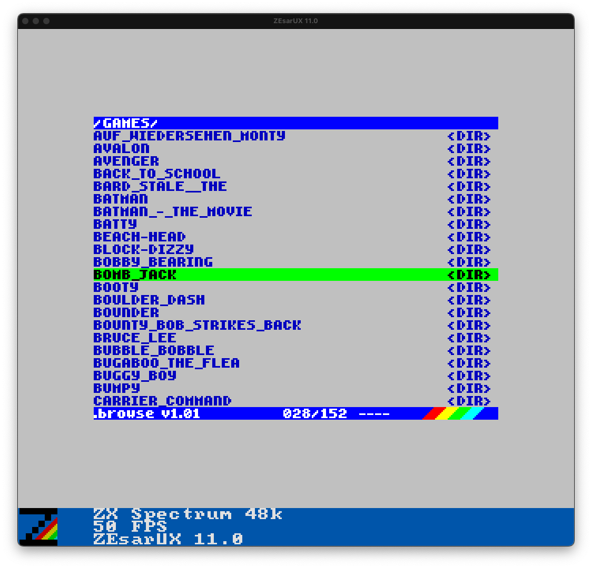

# NEWDIV

**A plug-and-play ZX Spectrum game collection for DivMMC, built on esxDOS and the ZEsarUX emulator.**

NEWDIV is a distribution of the ZX Spectrum Top 100 — a lovingly curated
collection of the greatest games ever made for the machine. It comes
ready to run in ZEsarUX, with esxDOS and a file browser already set up
inside the disk images. Pick a game, load it, play it. Just like it
always should have been.

| | | |
|:---:|:---:|:---:|
|  |  |  |
| Root directory | Navigate into a game | Load and play |

---

## What's in the box

The collection is split across two volumes:

| Volume | Games | Range |
|--------|-------|-------|
| [NEWDIV 0.1.1](NEWDIV_0.1.1__GAMES.txt) | 1–151 | 180 → Lunar Jetman |
| [NEWDIV 0.1.2](NEWDIV_0.1.2__GAMES.txt) | 152–302 | Mad Mix Game → Zzoom |

Each volume is a self-contained `.mmc` image with esxDOS, the BROWSE launcher, and all games installed under `/GAMES`.

---

## Requirements

- **[ZEsarUX](https://github.com/chernandezba/zesarux)** — the emulator (macOS, Linux, Windows)
- **[hdfmonkey](https://github.com/gasman/hdfmonkey)** — only needed if you want to rebuild the images from scratch
- **akeley's game collection** — [ZXSpectrumTop100-noDoc](https://archive.org/details/zxspectrum-top-100) — only needed for rebuilding

If you just want to play, the pre-built `.mmc` images are all you need.

---

## Quickstart

### Launch (ZEsarUX)

```bash
# Volume 1
./launch_newdiv1.sh

# Volume 2
./launch_newdiv2.sh
```

The launch scripts auto-detect ZEsarUX in the following order:
1. macOS app bundle — `/Applications/zesarux.app`
2. System `PATH`
3. `./zesarux` in the current directory

<div align="center">



</div>

### Mount (macOS — inspect the image directly)

```bash
./mount_newdiv1.sh
./mount_newdiv2.sh
```

> **Note:** the mount scripts use `hdiutil` and are macOS-only.

---

## Rebuilding the images from scratch

If you want to repopulate the `.mmc` images yourself from akeley's collection:

1. Create the empty MMC images:

```bash
hdfmonkey create newdiv1/newdiv1.mmc 64M
hdfmonkey create newdiv2/newdiv2.mmc 64M
```

2. Download [ZXSpectrumTop100-noDoc](https://archive.org/details/zxspectrum-top-100) and unpack it somewhere.
3. Open `distro/makediv1.sh` and `distro/makediv2.sh` and set the two variables at the top:

```bash
GAMES_SRC="/path/to/ZXSpectrumTop100-noDoc"   # <-- set this
MMC="newdiv1/newdiv1.mmc"                       # <-- set this if needed
```

4. Run:

```bash
bash distro/makediv1.sh
bash distro/makediv2.sh
```

Requires `hdfmonkey` on your `PATH`.

---

## Repository structure

```
.
├── README.md
├── NEWDIV_0.1.1__GAMES.txt   # Volume 1 — full game list and acknowledgements
├── NEWDIV_0.1.2__GAMES.txt   # Volume 2 — full game list and acknowledgements
├── launch_newdiv1.sh          # Launch Volume 1 in ZEsarUX
├── launch_newdiv2.sh          # Launch Volume 2 in ZEsarUX
├── newdiv1/
│   ├── ESXMMC.BIN             # esxDOS ROM
│   └── newdiv1.mmc            # Volume 1 disk image
├── newdiv2/
│   ├── ESXMMC.BIN             # esxDOS ROM
│   └── newdiv2.mmc            # Volume 2 disk image
└── distro/
    ├── makediv1.sh            # Rebuild Volume 1 from source
    ├── makediv2.sh            # Rebuild Volume 2 from source
    ├── mount_newdiv1.sh       # Mount Volume 1 (macOS)
    ├── mount_newdiv2.sh       # Mount Volume 2 (macOS)
    ├── esxdos/                # esxDOS 0.8.9 binaries
    └── fossil/                # Bob Fossil's BROWSE file manager v1.01
```

---

## Acknowledgements

Full credits are in the game list files. In brief:

- **akeley** — the curated Top 100 collection at the heart of this release
- **Bob Fossil** — BROWSE file manager and Spectrum documentation
- **Miguel Guerreiro & Mario Prato** — esxDOS
- **Cesar Hernandez Bano** — ZEsarUX
- **Steve Wetherill** — veteran Spectrum and Amstrad developer (Manic Miner, Jet Set Willy, Nodes of Yesod, Robin of the Wood, Projectyle), currently chronicling his memoir at [stevewetherill.substack.com](https://stevewetherill.substack.com/p/chapter-7-the-astronaut-and-the-sleeping)

---

*NEWDIV 0.1.1 / 0.1.2 — The ZX Spectrum Top 100 Collection*